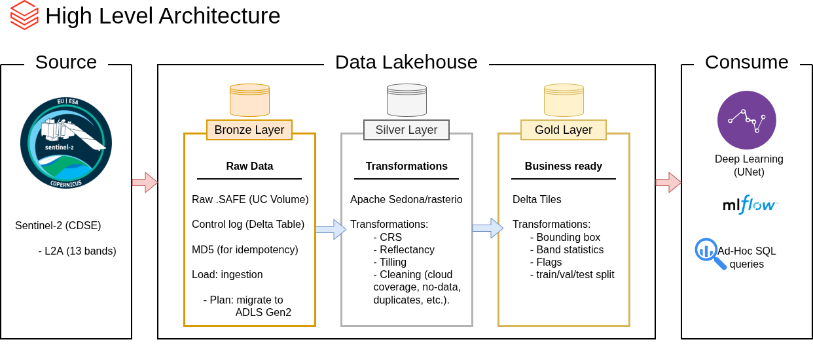

# Data Lakehouse for Field Cognition Analytics
> [!WARNING]  
> **This repository is under construction. Things under development are marked with 🚧**

Welcome to the **Data Lakehouse for Field Cognition Analytics** repository! 🛰️

This project will ingest, transform, and add business logic to satellite data from the [Copernicus](https://www.copernicus.eu/en) Sentinel-2 satellite. 

## 🏗️ Data Architecture

The data architecture for this project follows Medallion Architecture **Bronze**, **Silver**, and **Gold** layers:



1. **Bronze Layer**: Raw data ingestion, schema inference and Delta tables storage.
2. **Silver Layer**: This layer includes data cleansing, standardization, flagging, and indexing.
3. **Gold Layer**: Houses business-ready data modeled into a tile schema required for the deep learning model (UNet) training.

---

## 🚀 Project

### Specifications
- **Data Sources**: Data ingested as .SAFE.zip files (JP2000) into an Azure Databricks UC Volume. An area and a range of time are given to ingest the 13 layers of the Sentinel-2 L2A data.
- **Data Quality**: Cleanse and resolve data quality issues.
- **Integration**: 🚧 
- **Scope**: 🚧 
- **Documentation**: 🚧

### 📂 Repository Structure
```
DataLakehouse-FieldCognitionAnalytics/
│
├── docs/                               # Project documentation and architecture details.
│   ├── high_level_architecture.md      # Idea draft shared by the data science team.
│   ├── high_level_architecture_v1.png  # Image file shows the project's architecture.
│   ├── data_catalog.md 🚧              # Catalog of datasets, including field descriptions and metadata.
│   ├── data_model.png 🚧               # Image file for data model.
│   ├── naming_conventions.md 🚧        # Consistent naming guidelines for tables, columns, and files.
│
├── scripts/                            # PySpark scripts for ETL and transformations.
│   ├── bronze/                         # Scripts for extracting and loading raw data.
│   ├── silver/ 🚧                      # Scripts for cleaning and transforming data.
│   ├── gold/   🚧                      # Scripts for creating UNet-ready data.
│
├── .gitignore                          # Files and directories to be ignored by Git.
├── LICENSE                             # License information for the repository.
├── README.md                           # Project overview and instructions.
├── info-updates.md                     # Information on what I have done/am working on, prep for meetings.
```
---

## 🛡️ License

This project is licensed under the [MIT License](LICENSE). You are free to use, modify, and share this project with proper attribution.

## 🌟 About Me

I'm **Tatiana M. Rodriguez**, I build data pipelines. For more than five years I did this in research before I called it "data engineering."
I design the systems that move data from raw input to something a business can act on, and I check that data quality at every step, not just the end.

Let's stay in touch! Feel free to connect with me on the following platforms:

[](https://linkedin.com/in/tmrodriguez-work)
[](www.tmrodriguez.com) 
[](mailto:tatianamrodriguez.contact@gmail.com)
