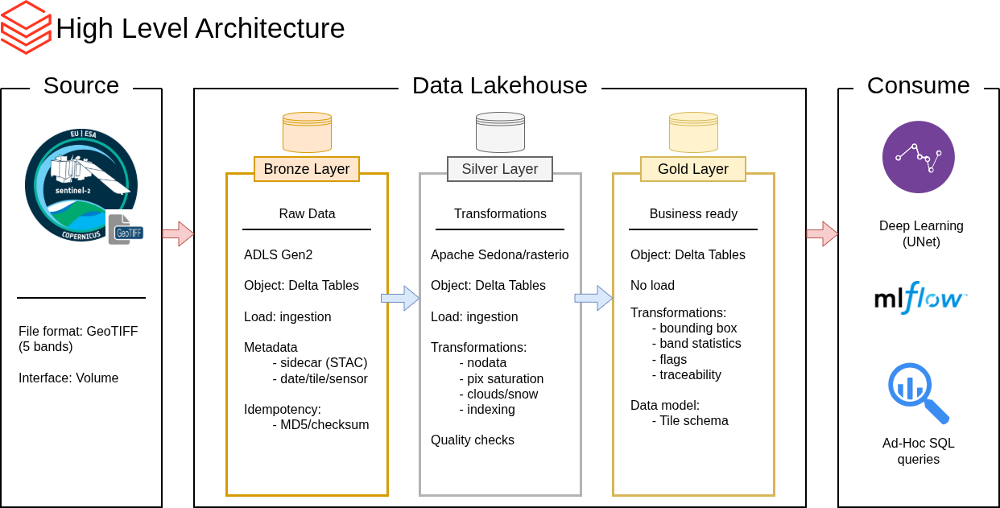

# Data Lakehouse for Field Condition Analytics
> [!WARNING]  
> **This repository is under construction.**

Welcome to the **Data Lakehouse for Field Condition Analytics** repository! 🛰️

This project will ingest, transform, and add business logic to satellite data from the [Copernicus](https://www.copernicus.eu/en) Sentinel-2 satellite. 

## 🏗️ Data Architecture

The data architecture for this project follows Medallion Architecture **Bronze**, **Silver**, and **Gold** layers:

1. **Bronze Layer**: Stores raw data as-is from the source system. Data is ingested from GeoTIFF files into Databricks Delta Tables.
2. **Silver Layer**: This layer includes data cleansing, standardization, flagging, and indexing to prepare data for analysis.
3. **Gold Layer**: Houses business-ready data modeled into a tile schema required for the deep learning model (UNet) training.

## 🛡️ License

This project is licensed under the [MIT License](LICENSE). You are free to use, modify, and share this project with proper attribution.

## 🌟 About Me

I'm **Tatiana M. Rodriguez**, a data professional with a Ph.D. in Physics and a knack for bringing order to chaos. I'm transitioning from research into data engineering, where I can apply the same analytical rigor to problems that drive real business decisions. 

Let's stay in touch! Feel free to connect with me on the following platforms:

 

