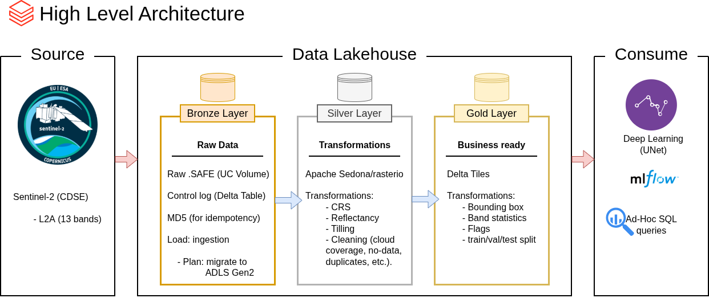

# Data Lakehouse for Field Cognition Analytics
> [!WARNING]  
> **This repository is under construction. Things under development are marked with 🚧**

Welcome to the **Data Lakehouse for Field Cognition Analytics** repository! 🛰️

This Databricks pipeline (Medallion Architecture) will process satellite imagery from the [Copernicus](https://www.copernicus.eu/en) Sentinel-2. It will ultimately feed a deep learning (UNet) semantic segmentation model.

## 🏗️ Data Architecture
 
The data architecture for this project follows Medallion Architecture **Bronze**, **Silver**, and **Gold** layers:
 



1. **Bronze Layer**: Raw `.SAFE.zip` archives ingested into an Azure Databricks Unity Catalog Volume (ADLS Gen2 planned), plus two Delta tables: an indexed STAC catalog of available scenes, and an ingestion control log for idempotency, retry tracking, and traceability.
2. **Silver Layer** 🚧: CRS reprojection, surface reflectance calculation, cloud/shadow/snow masking (SCL-based, pixel-level), tiling, and band resampling.
3. **Gold Layer** 🚧: Business-ready data modeled into a tile schema required for UNet training, including geospatial train/val/test split.
 
## 🚀 Project
 
### Specifications
- **Data Source**: Sentinel-2 L2A scenes (13 spectral bands, JP2000 format) from the Copernicus Data Space Ecosystem (CDSE), queried via STAC + OData APIs for a configurable area of interest (AOI) and date range.
- **Data Quality**: MD5 checksum verification during streaming download (no second read pass), partial/corrupt file cleanup, and a control table distinguishing retryable vs. permanent ingestion failures.
- **Multi-AOI support**: scenes are tagged with `aoi_id`, so multiple areas of interest can coexist in the same tables without needing to wipe data when switching zones.
- **Integration**: CDSE authentication via OAuth2, credentials resolved through Databricks secret scopes.
- **Scope**: currently limited to data engineering (pipeline design, ingestion, and (planned) transformation into model-ready tiles). Model architecture, spectral index selection, and geophysical interpretation are out of scope, owned by the science team.
- **Documentation**: in progress -> see [Current Status](#-current-status) below.
  
### 📂 Repository Structure
```
DataLakehouse-FieldCognitionAnalytics/
│
├── docs/                               # Project documentation and architecture details.
│   ├── high_level_architecture.md      # Idea draft shared by the data science team.
│   ├── high_level_architecture_v1.png  # Image file showing the project's architecture.
│   ├── data_catalog.md 🚧              # Catalog of datasets, including field descriptions and metadata.
│   ├── data_model.png 🚧               # Image file for data model.
│   ├── naming_conventions.md 🚧        # Consistent naming guidelines for tables, columns, and files.
│
├── conf/
│   └── ingestion_config.yaml           # AOIs, CDSE endpoints, retry policy, ingestion parameters.
│
├── notebooks/
│   ├── discover_stac_scenes.ipynb      # Indexes STAC metadata for the active AOI.
│   └── orchestration_bronze.ipynb      # Orchestrates download of pending scenes.
│
├── src/                                # PySpark/Python modules for ETL and transformations.
│   ├── cdse_client.py                  # CDSE OAuth2 authentication and OData product resolution.
│   ├── control_table.py                # Ingestion control table (idempotency, batched logging).
│   ├── exceptions.py                   # PermanentIngestionError / TransientIngestionError.
│   ├── ingestion.py                    # Download orchestration, checksum verification, retry logic.
│   ├── metadata.py                     # Enriched per-scene metadata.json construction.
│   ├── stac_discovery.py               # STAC query and indexed-table writes.
│   ├── tile_utils.py                   # MGRS tile_id extraction from product name.
│   ├── silver/ 🚧                      # Reprojection, reflectance calc, masking, tiling.
│   ├── gold/ 🚧                        # UNet-ready tile schema.
│
├── requirements.txt                    # Python dependencies (pystac-client, shapely, rasterio, etc.)
├── .gitignore                          # Files and directories to be ignored by Git.
├── LICENSE                             # License information for the repository.
├── README.md                           # Project overview and instructions.
├── info-updates.md                     # Working log for progress notes and meeting prep, not user-facing.
```
 
### 🔧 Setup
 
1. Clone as a Databricks Git folder (Workspace → Create → Git folder).
2. Create the CDSE secret scope:
```
   databricks secrets create-scope cdse
   databricks secrets put-secret cdse username
   databricks secrets put-secret cdse password
```
3. Set the area of interest in `conf/ingestion_config.yaml` (`bbox`, date range, `active_aoi`).
4. Install dependencies: `%pip install -r requirements.txt` in the first cell of each notebook.
5. Run `discover_stac_scenes.ipynb` to index the catalog, then `orchestration_bronze.ipynb` to download.
   
 
## 📌 Current Status
 
Snapshot, kept up to date as the project evolves:
 
- ✅ Bronze layer functional end-to-end: discovery, download, checksum verification, idempotent retries, batched logging, multi-AOI support.
- 🚧 Ongoing refactor from a monolithic notebook into `src/` modules — code is stabilizing.
- ❌ No unit tests nor CI configured yet. Planned next, since pure logic (parsing, checksum, metadata construction) is already decoupled from Spark/network dependencies.
- 💡 Silver and Gold layers: design discussed, no code yet.

 
## 🛡️ License
 
This project is licensed under the [MIT License](LICENSE). You are free to use, modify, and share this project with proper attribution.

## 🌟 About Me

I'm **Tatiana M. Rodriguez**, I build data pipelines. For more than five years I did this in research before I called it "data engineering."
I design the systems that move data from raw input to something a business can act on, and I check that data quality at every step, not just the end.

Let's stay in touch! Feel free to connect with me on the following platforms:

[](https://linkedin.com/in/tmrodriguez-work)
[](www.tmrodriguez.com) 
[](mailto:tatianamrodriguez.contact@gmail.com)
