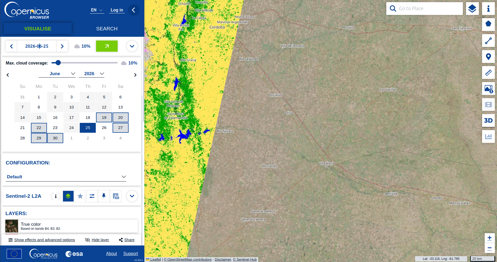

### Sep 7, 2026
Pude hacer andar las verificaciones y tests, la tabla de control anda bien tambien. \
Problema: cada que corro el script descarga los datos de nuevo. No filtra bien por status = 'success' o hay alguna otra diferencia (timestamp, etc) que domina y me estoy perdiendo?

### Sep 4, 2026
* Verificaciones, tests, limpiezas:
  * checksum + size verification: para que asegurar que se descargan todos los datos por escena.
  * retry: si la descarga falla le da retry a los 5 segundos. Si vuelve a fallar intenta 2 veces mas a los 10 y a los 20 seg.
  * failure cleanup: borra archivos zip con datos parciales/corruptos.
  * se escribe un log cada 20 escenas descargadas. Elijo esto por sobre un solo log para que sea mas facil encontrar donde la pipeline puede haber fallado (si algun dia lo hace) y por sobre un log por escena para no tener un choclo enorme. 

### Sep 3, 2026
* Movi el area de interes (la bounding box en el script de la capa bronce) hacia una region rodeando Tucuman.
* Las bandas que se obtienen son las mismas, no varian las opciones de resolucion disponible por area ni por rango temporal. Son:\
  B04_10m, B04_20m, B04_60m\
  B08_10m\
  B11_20m, B11_60m\
  B12_20m, B12_60m\
  SCL_20m, SCL_60m
* Explorando los datos a traves de la web de Copernicus, se ve que aunque haya datos cada un par de dias, solo 1 o 2 veces al mes se observa el mismo area:

