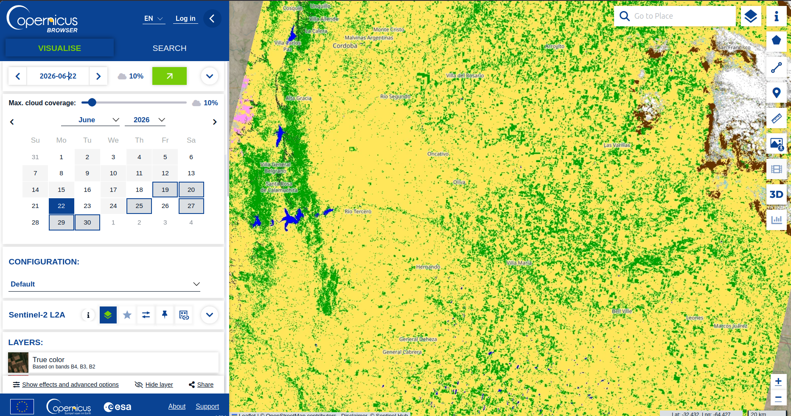
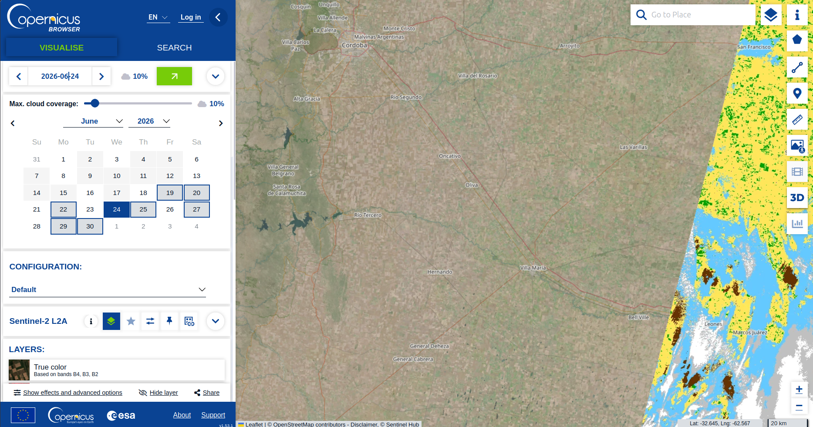

## Planning capa Silver
### Transformaciones

1. **Reproyeccion**: si el area de estudio cae en el limite entre dos zonas UTM, vamos a tener tiles vecinos con sistemas de coordenadas de referencia (CRS) distintos (EPSG:32720 vs EPSG:32721, por ejemplo). Por las dudas, reproyectamos todo a un CRS comun antes de tilear.

2. **Mascara de nubes/sombras/nieve**: las bandas indican el % de toda la escena, esto no nos ayuda si por ejemplo una escena con 15% de nubosidad tiene un tile 100% tapado. Usar la capa SCL para flaggear.

3. **Manejo de no-data/bordes**: los bordes de la escena satelital y las zonas de overlap entre pasadas del satelite tienen pixeles no-data. Que % de tiles no-data usamos de tolerancia? (i.e., descartar el tile si >X% de pixeles es no-data).

4. **Seleccion y resampling de bandas**: Sentinel-2 tiene bandas de tres resoluciones (10m, 20m, 60m). De las bandas que me paso Feli que necesitan, tienen todas opcion de resolucion de 20m excepto la B08, que tiene solo 10m. Si el UNet necesita una resolucion uniforme, resampleamos las de 10/20m a 60m para usar todos los datos (caveat, las iamgenes son tomadas simultaneamente), tomamos solo las de 20m (resampleampleando la B08), tomamos solo las de 60m, o tomamos TODO? Que metodo de resampling usamos (nearest/bilinear/cubic)?

5. **Normalizacion**: chequear que se esta aplicando el offset correcto para evitar corrimiento sistematico en los valores. --> Copernicus cambio el esquema de offset en procesamiento en 2022, baseline 04.00+. Esto cambia bastante seguido parece asi que no deberiamos harcodearlo.

6. **Tipo de dato y precision**: si no tenemos problemas de storage, guardamos la reflectancia ya calculada ((DN + offset) / 10000 en un float32). Si esto se convierte en un problema, tendremos que guardar el DN (unit16) y hacer la transformacion medio OTF.

7. **Deduplicacion**: si el area de interes cae en el overlap entre dos swaths consecutivos del satelite, tendremos cobertura duplicada. Que criterio de escena prevalece (menor cloud cover, mas reciente, etc)? --> Esto es _en caso que_ sea un problema para el modelo ver el mismo terreno dos veces con distinta fecha en el mismo batch.

### Otras preguntas
* Tamaño de tile y overlap que espera el input del UNet --> Esto creo que no lo sabemos todavia, elijo algo para empezar o tienen ya una idea?
* Compositing temporal: el modelo consumira una imagen por tile o un composite multi-fecha (e.g., media de 3 meses para eliminar nubes residuales)? 
* Bandas + indices espectrales requeridos por el modelo --> Tampoco lo sabemos aun creo, pero lo necesito para saber que columnas van en la capa silver.
* Split train/val/test: se define en la capa silver (flag por tile) o despues (en el pipeline de entrenamiento)? Si es la silver, cual seria el criterio? Las opciones son aleatorio o por tile geografico. Estuve buscando otros ejemplos parecidos y parece que si no separamos por tile geografico (y dejamos que tiles vecinos/solapados caigan en train y val), vamos a tener data leakage severo y metricas de validacion infladas (aparentemente es un error clasico en segmentacion de imagenes satelitales).

___
## Updates/notas
### Sep 7, 2026
* Pude hacer andar las verificaciones y tests, la tabla de control anda bien tambien por fin!
* Problema: cada que corro el script descarga los datos de nuevo. No filtra bien por status = 'success' o hay alguna otra diferencia (timestamp, etc) que domina y me estoy perdiendo?
* Pasarle el script a una IA a ver que ofrecen para optimizar y/o hacer el script mas facil de leer, siento que es un tremendo choclo en este momento.

### Sep 4, 2026
* Verificaciones, tests, limpiezas:
  * checksum + size verification: para que asegurar que se descargan todos los datos por escena.
  * retry: si la descarga falla le da retry a los 5 segundos. Si vuelve a fallar intenta 2 veces mas a los 10 y a los 20 seg.
  * failure cleanup: borra archivos zip con datos parciales/corruptos.
  * se escribe un log cada 20 escenas descargadas. Elijo esto por sobre un solo log para que sea mas facil encontrar donde la pipeline puede haber fallado (si algun dia lo hace) y por sobre un log por escena para no tener un choclo enorme. 

### Sep 3, 2026
* Movi el area de interes (la bounding box en el script de la capa bronce) hacia una region rodeando Tucuman.
* Las bandas que se obtienen son las mismas, no varian las opciones de resolucion disponible por area ni por rango temporal. Son:\
  B04_10m, B04_20m, B04_60m\
  B08_10m\
  B11_20m, B11_60m\
  B12_20m, B12_60m\
  SCL_20m, SCL_60m
* Explorando los datos a traves de la web de Copernicus, se ve que aunque haya datos cada un par de dias, solo 1 o 2 veces al mes se observa el mismo area:

